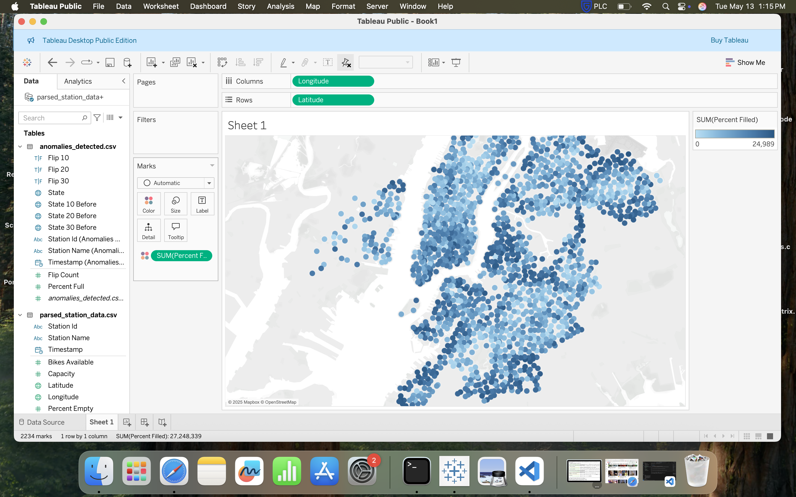
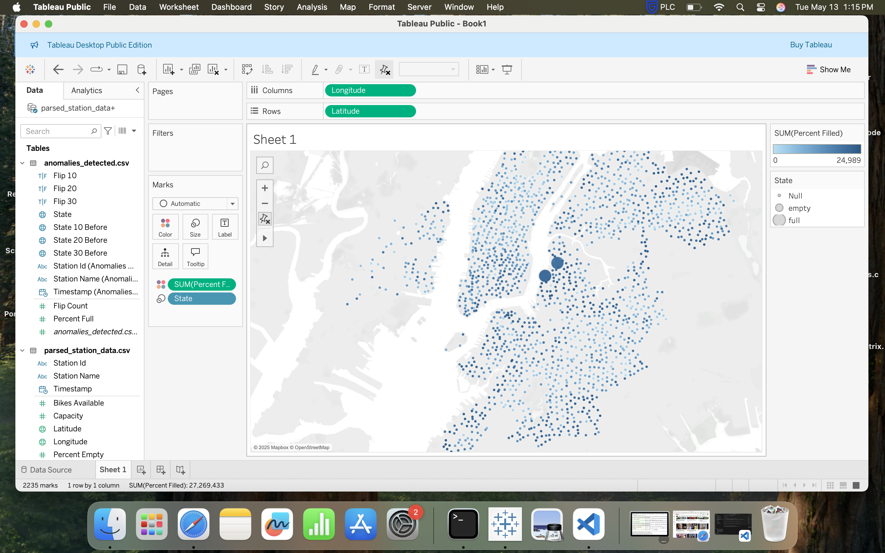

# 🚲 CitiBike Station Anomaly Detection

This project monitors **real-time CitiBike data** to detect anomalous behavior at docking stations. We focus on **frequent flipping between empty and full states**, which could indicate operational issues or unusual usage patterns.

---

## ⚙️ Core Functionality

### `internal/api/api.go`

Fetches dynamic station status from the CitiBike GBFS API:

```go
url := "https://gbfs.citibikenyc.com/gbfs/2.3/en/station_status.json"
````

Parses key metrics like:

* `num_bikes_available`
* `num_docks_available`
* `num_ebikes_available`
* `num_scooters_available`
* `is_renting`
* `is_returning`
* `station_id`
* `last_reported`

### `internal/processing/processing.go`

Performs essential calculations:

* `CalculatePercentFilled()` – calculates percentage of available bikes.
* `CalculatePercentEmpty()` – calculates percentage of empty docks.
* `CreateStationMap()` – maps station IDs to metadata for faster lookup.

---

## 🛠️ Data Parsing & Feature Engineering

After retrieving the raw data from the CitiBike API, it must be **parsed and transformed** to extract relevant metrics. This includes calculating **percentages**, deriving **station states**, and aligning timestamps for consistent comparisons.

From there, we apply **feature engineering** to build time-based trends, compute rolling statistics, and flag specific station behaviors. These features feed into our anomaly detection system to make sense of real-time fluctuations in station activity.

---

## 🧠 Anomaly Detection Logic

### `anomaly_detection/detect_flips.py`

Detects station "flipping" anomalies based on:

* Sudden changes between `empty` and `full` states
* Rolling flip counts over time (default: 45 minutes)
* Flip threshold (default: 3 flips in a 45-minute window)
* Compares current state to 10, 20, and 30 rows prior to detect pattern

The goal is to flag **stations behaving abnormally**, such as those repeatedly toggling between states, which could signal maintenance issues or demand shocks.

**Example Output:**

```csv
timestamp,station_id,station_name,percent_full,state,flip_count
2025-05-08 16:00:00,29a41b09-698f...,41 St & 3 Ave,0.05,empty,4
2025-05-08 16:30:00,dd482585-3028...,2 Ave & 36 St,0.95,full,5
```

---

## 📦 Tools & Technologies

* **Go** – for API interaction and efficient data processing
* **Python** – for anomaly detection using pandas
* **MySQL** – for storing station and anomaly data
* **GitHub Pages** – for project documentation using Jekyll

---

## 📈 Use Cases

* Monitor bike rebalancing operations
* Identify unusual rider activity patterns

---

## 📷 Visuals

*Visualizations and videos of anomaly detection results coming soon!*

You’ll soon find:

### Map Screenshot Placeholder


### Map Screenshot Placeholder


### Map Screenshot Placeholder

---

## 🎥 Demo Video

Here’s a walk-through of the anomaly detection system in action:

  <iframe width="560" height="315" src="https://www.youtube.com/embed/Ik1FlE2llmI" title="YouTube video player" frameborder="0" allowfullscreen></iframe>

---

## 🚀 Demo & Deployment

The project can be run locally or deployed on a cloud instance. Output anomalies can be visualized through:

* Tableau or Power BI dashboards
* Embedded HTML graphs or maps

---

## 👤 Author

**Daniel Brown**
📧 [your.email@example.com](mailto:djbrown227@gmail.com)
🔗 [GitHub](https://github.com/djbrown227/citibike_anomaly_detection) | [LinkedIn](https://www.linkedin.com/in/daniel-brown-203288146/)

---

> Built for speed. Tuned for insight. Powered by real-time CitiBike data.
